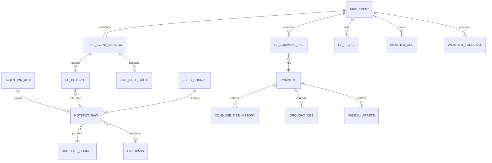

# Vigifeu — Spécification 01 : Modèle de données

**Version :** 0.4
**Référence :** document de cadrage v0.3
**Périmètre :** phase pré-SaaS (SQLite + Parquet), schéma conçu pour migrer vers PostGIS sans refonte.

---

## 1. Principes structurants

Ces principes gouvernent tout le modèle ; toute évolution future doit les respecter.

**P1 — Les observations sont immuables.** Un hotspot, une mesure météo, un indice de sécheresse sont des faits horodatés : on les insère, on ne les modifie jamais, on ne les supprime jamais (au pire on les marque). Toute l'interprétation (clustering, qualification, rattachement) vit dans des tables séparées, recalculables.

**P2 — Séparation observation / interprétation.** Si le clustering ou la qualification s'améliorent, on doit pouvoir rejouer tout l'historique brut avec le nouvel algorithme. Le brut est le capital ; l'interprétation est du code.

**P3 — Double horodatage systématique.** Chaque donnée porte (a) l'horodatage du phénomène (`observed_at` / `acq_at` — quand le satellite a vu, quand le vent soufflait) et (b) l'horodatage d'ingestion (`ingested_at` — quand nous l'avons su). L'écart entre les deux **est** la mesure de latence (cadrage §6bis) ; il ne se reconstruit pas après coup.

**P4 — Catégorie de donnée explicite.** Toute valeur exposée appartient à l'une des quatre catégories du cadrage §8.3 : `mesuree` / `declaree` / `estimee` / `prevue` (prévision d'organisme officiel). La catégorie est portée par le schéma (colonne ou convention de table), pas décidée à l'affichage.

**P5 — Historisation de ce qui ne se reconstruit pas.** Versions successives des FireEvents, relations feu-commune horodatées, heures d'ingestion : conservées dès le premier jour, même si aucune interface ne les consomme encore.

**P6 — Identifiants stables et publics dès la conception.** Les identifiants qui finissent dans des URLs (feux, communes) sont pérennes et lisibles : ils servent la navigation, la citation presse et le référencement (SEO/GEO — cf. §8).

**P7 — Tout est UTC en base.** Conversion en heure locale uniquement à l'affichage, côté client.

---

## 2. Vue d'ensemble

Trois familles :

* **Observations brutes** (immuables) : `hotspot_raw`, `weather_obs`, `weather_forecast`, `drought_obs`, `vigieau_arrete` + journal `ingestion_run` ;
* **Interprétation** (recalculable, versionnée) : `fire_event`, `fire_event_version`, `fire_cell_state`, `fe_commune_rel`, `fixed_source` ;
* **Référentiels** (mis à jour par millésimes) : `satellite_source`, `commune`, `commune_fire_history` (BDIFF), POI (phase ultérieure).

---

## 3. Observations brutes

### 3.1 `hotspot_raw` — détections satellitaires

La table la plus importante du système. Une ligne = un pixel chaud vu par un instrument à un instant.

| Champ | Type | Description |
|---|---|---|
| `id` | INTEGER PK | interne, auto |
| `source_id` | FK → satellite_source | ex. VIIRS_SNPP_NRT |
| `lat`, `lon` | REAL | centre du pixel (WGS84) |
| `acq_at` | TEXT (ISO UTC) | date+heure d'acquisition (P3-a) |
| `ingested_at` | TEXT (ISO UTC) | première apparition chez nous (P3-b) |
| `ingestion_run_id` | FK | traçabilité |
| `frp_mw` | REAL NULL | puissance radiative |
| `confidence` | TEXT | valeur source (l/n/h ou %) — non normalisée, on garde le brut |
| `scan_km`, `track_km` | REAL | taille réelle du pixel |
| `day_night` | TEXT | D/N — indispensable pour comparer les FRP (§7ter) |
| `raw_payload` | TEXT NULL | ligne CSV source complète (audit) |
| `overpass_id` | FK NULL | rattachement au passage (3.2) |
| `fixed_source_id` | FK NULL | si expliqué par une source fixe connue (5.4) |

Unicité : `(source_id, lat, lon, acq_at)` — c'est la clé de déduplication à l'ingestion (réingérer un jour déjà connu est un no-op). La déduplication **inter-satellites** (SNPP vs NOAA-20 voyant le même feu) n'est *pas* faite ici : deux satellites = deux observations vraies. Elle se fait à l'agrégation (4.2), en raisonnant par passage.

Latence mesurée = `ingested_at − acq_at`, calculable par simple requête — c'est le protocole de monitoring du cadrage §6bis, gratuit dès que l'ingestion tourne toutes les 15 min.

### 3.2 `overpass` — passages satellite

Regroupement dérivé des hotspots par (satellite, fenêtre temporelle) : `id`, `source_id`, `window_start`, `window_end`, `day_night`, `n_hotspots`. Sert à : comparer les FRP entre passages comparables (nuit/nuit), dédupliquer inter-satellites, définir « détecté au dernier passage ». Recalculable.

### 3.3 `weather_obs` — météo constatée (catégorie `mesuree`/`estimee`)

Météo au voisinage d'un feu, échantillonnée à chaque cycle d'ingestion tant que le feu est actif.

| Champ | Type | Description |
|---|---|---|
| `id` | PK | |
| `fire_event_id` | FK | feu concerné |
| `lat`, `lon` | REAL | point d'échantillonnage (centroïde v1 ; front à terme, cadrage §5.4) |
| `observed_at` | TEXT UTC | validité de la mesure (P3-a) |
| `fetched_at` | TEXT UTC | quand on l'a récupérée (P3-b) |
| `provider` | TEXT | open-meteo / meteo-france / … |
| `wind_speed_kmh`, `wind_gusts_kmh`, `wind_dir_deg` | REAL | la donnée reine |
| `temp_c`, `rh_pct` | REAL | température, humidité relative |
| `precip_mm_1h`, `precip_mm_24h` | REAL | pluie constatée |

Règle d'affichage (cadrage §5.4) : un vent n'est jamais montré à côté de détections d'un autre horodatage sans que les deux horodatages soient visibles.

### 3.4 `weather_forecast` — prévisions officielles (catégorie `prevue`)

| Champ | Type | Description |
|---|---|---|
| `id` | PK | |
| `fire_event_id` FK NULL / `code_insee` FK NULL | | cible (feu ou commune) |
| `provider`, `model` | TEXT | ex. open-meteo / AROME |
| `model_run_at` | TEXT UTC | run du modèle (une prévision est identifiée par son run) |
| `valid_at` | TEXT UTC | échéance |
| `precip_mm`, `precip_prob_pct`, `wind_speed_kmh`, `wind_dir_deg`, `temp_c`, `rh_pct` | REAL | |
| `fetched_at` | TEXT UTC | |

Les prévisions successives d'une même échéance coexistent (une par run) : on affiche la plus récente, on garde les autres (audit, et un jour : « la prévision s'est-elle réalisée ? »). Libellé d'affichage contractuel : « Prévision {provider}/{model} : … » (cadrage §4.1).

### 3.5 `drought_obs` — sécheresse et danger (catégorie `mesuree`/`estimee`)

Une table générique multi-indices, à la maille disponible :

| Champ | Type | Description |
|---|---|---|
| `id` | PK | |
| `indicator` | TEXT | `fwi` / `ffmc` / `dmc` / `dc` / `isi` / `bui` / `meteo_forets` / `sim_swi` |
| `code_insee` FK NULL / `dept` NULL / `lat`,`lon` NULL | | maille commune, département (Météo des forêts) ou point de grille selon la source |
| `valid_date` | TEXT | jour (ou décade pour SIM) |
| `value` | REAL | valeur brute (second niveau d'affichage) |
| `value_class` | TEXT NULL | classe officielle si la source en fournit (ex. Météo des forêts : 4 niveaux) |
| `provider`, `fetched_at` | | |

La **traduction métier** (« sécheresse profonde très élevée pour la saison ») n'est pas stockée ici : c'est une fonction d'affichage (barèmes versionnés dans le code), pour pouvoir l'améliorer sans réécrire l'historique. Exception : `value_class` quand la classe est elle-même une donnée officielle.

### 3.6 `vigieau_arrete` — restrictions d'eau (catégorie `declaree`, source officielle)

`id`, `code_insee`, `niveau` (vigilance/alerte/alerte renforcée/crise), `date_debut`, `date_fin` NULL, `arrete_ref`, `fetched_at`. Contexte d'exposition pour la fiche commune.

### 3.7 `ingestion_run` — journal d'ingestion

`id`, `source`, `params` (ex. jour demandé), `started_at`, `finished_at`, `status`, `http_status`, `n_rows`, `error_text`. C'est la boîte noire : quotas, lenteurs des jours de grands feux, trous de collecte — tout ce que le prototype a rencontré devient observable.

### 3.8 Tables techniques

* **`geo_detection_raw`** *(réservée, phase 2 — MTG-FCI FIR, Spec 02 §9)* : structure sœur de `hotspot_raw` (source, lat/lon du pixel, `acq_at`, `ingested_at`, intensité, `raw_payload`), confiance `probable` ; champ `confirmed_by_fire_event_id` NULL renseigné à la confirmation VIIRS.
* **`regen_queue`** : file de régénération consommée par le générateur (Spec 04 §2) — `id`, `page_type` (`carte`/`feu`/`commune`/`sitemap`), `page_ref`, `enqueued_at`, `processed_at` NULL, `trigger` (run d'ingestion ou tâche à l'origine).

---

## 4. Interprétation : le feu

### 4.1 `fire_event` — identité stable

| Champ | Type | Description |
|---|---|---|
| `id` | INTEGER PK | interne |
| `public_id` | TEXT UNIQUE | `2026-saumos` — figé à la publication, sert d'URL (P6). Unicité : en cas de collision (second feu au même lieu la même année, ex. reprise au-delà de `T_reprise`), suffixe incrémental `2026-saumos-2` |
| `created_at` | TEXT UTC | création de l'objet |
| `first_acq_at` | TEXT UTC | première détection **du cluster spatio-temporel** (donnée contractuelle — cf. leçon du 20/07 à 12,6 km, cadrage §7bis) |
| `last_acq_at` | TEXT UTC | dernière détection |
| `qualification` | TEXT | `vegetation_confirme` / `suspect_source_fixe` / `suspect_isole` / `faux_positif` (taxonomie §7.1) |
| `qualification_reason` | TEXT | trace de la règle qui a décidé (explicabilité) |
| `lifecycle` | TEXT | `actif` / `plus_detecte` (jamais « éteint ») / `fusionne` / `archive` |
| `merged_into` | FK NULL | FireEvent absorbant si `lifecycle=fusionne` (Spec 02 §4.1) |
| `confidence_level` | TEXT | `confirme` / `probable` / `signalement` (hiérarchie §5.7) |

**Transitions de cycle de vie** (seuils paramétrés, valeurs initiales — règles détaillées en Spec 02 §4.5) :

* `actif → plus_detecte` : aucune détection depuis `T_silence` (init : 24 h, ~2 groupes de passages VIIRS manqués) ;
* `plus_detecte → actif` : reprise (Spec 02 §4.3) ;
* `plus_detecte → archive` : `T_reprise` (init : 7 jours) écoulé sans nouvelle détection ;
* `actif/plus_detecte → fusionne` : absorption par un autre FireEvent (terminal, avec `merged_into`).

L'attribution d'un `public_id` (année + slug du lieu principal) intervient quand le feu est publié ; les événements suspects n'en reçoivent pas.

### 4.2 `fire_event_version` — états successifs

Une version = l'état du feu après chaque cycle d'ingestion qui l'a modifié. C'est la matérialisation du « historique versionné » (cadrage §8.1) et le support de la relecture de propagation. **Économie sur les suspects** : les événements non publiés (`suspect_source_fixe`, `suspect_isole`) ne sont pas versionnés à chaque cycle — une source industrielle détectée quotidiennement accumulerait des centaines de versions sans valeur ; seul leur agrégat d'évidence est mis à jour (Spec 02 §5.1), une version n'étant créée qu'au changement de qualification.

| Champ | Type | Description |
|---|---|---|
| `id` | PK | |
| `fire_event_id` | FK | |
| `version_n` | INTEGER | séquence |
| `computed_at` | TEXT UTC | |
| `trigger_ingestion_run_id` | FK | quel passage a produit cette version |
| `geometry_wkt` | TEXT | enveloppe (hull) — GeoJSON/WKT ; GeoParquet à l'archive |
| `n_hotspots`, `n_hotspots_dedup` | INTEGER | brut et dédupliqué inter-satellites |
| `frp_total_last_pass_mw` | REAL | par passage, pas cumulé (comparabilité §7ter) |
| `area_ha_estimee` | REAL NULL | estimation d'emprise (catégorie `estimee`, affichée comme telle) |
| `front_progress_km`, `front_bearing_deg` | REAL NULL | progression **mesurée** entre versions comparables |
| `stats_json` | TEXT | reste des agrégats |

`fe_hotspot` (table de lien) : `fire_event_version_id`, `hotspot_id`, `dedup_group` (les hotspots SNPP/NOAA-20 d'un même pixel physique partagent un groupe — stratégie **par passage** : fenêtres à < 20 min et pixels à < 375 m, cf. Spec 02 §6).

### 4.3 `fire_cell_state` — cycle de vie spatial

Le découpage en cellules ~750 m validé en prototype (§7ter). Par version (ou par feu, mise à jour en place — à trancher au premier volume réel) :

`fire_event_id`, `cell_key` (indice de grille), `lat`, `lon`, `first_acq_at`, `last_acq_at`, `frp_max_mw`, `state` calculé (`front_actif` / `recent` / `plus_detecte`) avec seuils **paramétrés** (calés VIIRS aujourd'hui, à revoir avec MTG — cadrage §7ter).

### 4.4 `fixed_source` — registre des sources fixes

La « carte des sources industrielles » précalculée (cadrage §7.1) :

`id`, `lat`, `lon`, `radius_m`, `kind` (`torchère`/`aciérie`/`raffinerie`/`inconnu`), `evidence_json` (jours de présence, FRP moyen, emprise), `status` (`confirme`/`candidat`/`invalide`), `first_seen`, `last_review_at`, `clc_code` NULL (croisement Corine). Les hotspots tombant dans un rayon d'une source confirmée sont marqués (`hotspot_raw.fixed_source_id`) et exclus du clustering feu — mais **conservés** (P1) : ils entretiennent l'évidence.

### 4.5 `fe_fe_rel` — relations entre feux

Relations FireEvent ↔ FireEvent produites par le pipeline (Spec 02 §4) :

`id`, `fire_event_id`, `related_fire_event_id`, `rel_type` (`fusionne_dans` / `proche_de`), `created_at`, `note` NULL. `fusionne_dans` double le pointeur `merged_into` en gardant l'historique des fusions multiples ; `proche_de` relie un nouvel événement à un feu récent voisin (contexte de fiche : « un feu a parcouru cette zone il y a N jours » — formulation factuelle, cadrage §4.1).

---

## 5. Référentiels

### 5.1 `satellite_source`

Configurable, jamais codé en dur (cadrage §5.1) : `id`, `code` (VIIRS_SNPP_NRT…), `platform`, `instrument`, `resolution_m`, `active` (bool), `api_params`, `notes` (ex. dérive orbitale SNPP).

### 5.2 `commune`

| Champ | Type | Description |
|---|---|---|
| `code_insee` | TEXT PK | identifiant stable (P6) |
| `slug` | TEXT | `le-porge` — avec le code INSEE, forme l'URL `/communes/33333-le-porge` |
| `nom`, `dept`, `region`, `epci_code` | TEXT | |
| `population` | INTEGER | millésime en métadonnée |
| `geometry_wkt` | TEXT | contour (Admin Express, généralisé pour l'affichage ; précis pour l'intersection) |
| `centroid_lat`, `centroid_lon` | REAL | |
| `surface_ha`, `surface_forestiere_ha` | REAL | précalcul (BD Forêt / CLC) |
| `pprif` | TEXT NULL | statut (prescrit/approuvé/néant) + référence |
| `obligation_debroussaillement` | BOOL NULL | |
| `exposition_structurelle` | REAL NULL | score précalculé (méthode à spécifier — module ultérieur) |
| `referentiel_millesime` | TEXT | version Admin Express source |

Les fusions de communes (communes nouvelles) sont gérées par une table `commune_succession` (`ancien_code`, `nouveau_code`, `date_effet`) : les codes INSEE morts redirigent, l'historique BDIFF reste rattachable.

### 5.3 `commune_fire_history` — BDIFF / Prométhée

`code_insee`, `annee`, `date_alerte`, `surface_ha`, `type_feu`, `source_base` (`bdiff` / `promethee`), `source_ref`. Import par millésime, Licence Ouverte 2.0 (cadrage §5.8). **Couvertures : BDIFF depuis 2006 (France entière, maille communale) ; Prométhée depuis 1973 (arc méditerranéen uniquement)** — la profondeur historique affichée sur une fiche commune dépend donc du périmètre. Alimente la fiche commune (valeur hors saison, cadrage §12).

### 5.4 `fe_commune_rel` — la relation cœur

La relation FireEvent ↔ Commune, **par intersection de géométries, multi-communes, historisée** (cadrage §8.2 / §7bis) :

| Champ | Type | Description |
|---|---|---|
| `id` | PK | |
| `fire_event_id`, `code_insee` | FK | |
| `rel_type` | TEXT | `emprise_dans_commune` / `a_moins_de_X` / `direction_vent` |
| `distance_km` | REAL NULL | pour `a_moins_de_X` (distance à la limite communale, pas au centroïde) |
| `valid_from`, `valid_to` | TEXT UTC | intervalle de validité — `valid_to` NULL = relation courante |
| `computed_from_version` | FK | version du feu qui a produit la relation |

Quand un cycle recalcule les relations, celles qui disparaissent sont **fermées** (`valid_to` renseigné), jamais supprimées : « Le Porge a été concernée du 22/07 14h32 au … » est une donnée d'historique et de fiche.

`rel_type = direction_vent` est dérivé de `weather_obs` (vent au moment du calcul) + géométrie : c'est un **fait composé de deux faits**, affiché avec le libellé contractuel « se trouve dans la direction actuelle du vent » et les deux horodatages (§4.1).

---

## 6. Correspondance stockage

| Donnée | État vivant (SQLite, WAL) | Archive (Parquet, DuckDB) |
|---|---|---|
| `hotspot_raw` | 14 jours glissants — **jamais purgé un hotspot rattaché à un FireEvent non archivé** (un méga-feu peut vivre plus de 14 jours) | partition `annee/mois/jour`, intégrale |
| `weather_obs` / `forecast` / `drought_obs` | fenêtre active | partition mensuelle |
| `fire_event` + versions + cells + relations | feux actifs et récents | export à l'archivage du feu (GeoParquet pour les géométries) |
| référentiels (`commune`, BDIFF, `satellite_source`, `fixed_source`) | intégraux dans SQLite | snapshot par millésime |
| `ingestion_run` | 90 jours | partition mensuelle |

Règles : l'archivage d'un feu (passage `lifecycle=archive`) exporte l'objet complet — versions, cellules, relations, météo associée — en un jeu de fichiers autonome ; la page publique du feu est régénérée une dernière fois depuis l'archive et devient définitive. Migration PostGIS : mêmes tables, `geometry_wkt` → colonnes `geometry` indexées ; aucune donnée ne change de sens.

---

## 7. Invariants et contraintes transverses

* Unités uniques en base : **ha** pour les surfaces, **km/h** pour le vent, **MW** pour le FRP, **km** pour les distances, **mm** pour la pluie. Toute conversion est de l'affichage (cadrage §8.3).
* Aucune colonne « updated_at » ne fait foi pour l'utilisateur : ce qui s'affiche est l'horodatage de la *donnée* (P3-a).
* Les champs de catégorie `estimee` (ex. `area_ha_estimee`) portent le suffixe `_estimee` dans le schéma : impossible de les afficher par accident comme une mesure.
* Tout ce qui décide (qualification, seuils de cycle de vie, barèmes de traduction) est **paramétré et versionné dans le code**, jamais implicite — `qualification_reason` garde la trace de la règle appliquée.
* Suppression interdite sur les tables d'observation (P1) ; correction = nouvelle ligne + marquage.

---

## 8. Ancrages SEO / GEO dans le modèle

La visibilité (moteurs de recherche classiques **et** moteurs génératifs / assistants IA) se joue en partie dès le modèle de données :

* **URLs stables et parlantes** : `public_id` des feux et `code_insee + slug` des communes sont conçus pour être cités (presse, rapports, réponses d'assistants). Une URL citée est un fait d'autorité ; elle ne doit jamais casser (P6, table de succession des communes).
* **Faits auto-citables** : chaque page expose des énoncés factuels datés et sourcés (« Premier hotspot VIIRS : 22/07/2026 12:32 UTC — source NASA FIRMS ») — exactement le format que les moteurs génératifs reprennent et attribuent. Le double horodatage et la traçabilité par source (P3, §3) rendent ces énoncés générables mécaniquement.
* **Données structurées** : le générateur de pages produira du JSON-LD (schema.org — `Place` pour les communes, `Event`/`Dataset` pour les feux, `Organization` pour l'éditeur) directement depuis ces tables — aucun champ supplémentaire requis si le modèle ci-dessus est respecté.
* **Couverture d'entités** : les fiches communes pré-générées (même « rien à signaler », avec historique et exposition) constituent le maillage d'entités nommées sur lequel se construit la visibilité organique hors saison (cadrage §8.5). Le déploiement progressif (communes BDIFF d'abord) définit l'ordre d'indexation.
* **Page méthodologie lisible par les machines** : sources, latences mesurées, définitions des libellés — c'est aussi ce qu'un moteur génératif lit pour décider si le site est une source fiable à citer.

Le reste du SEO/GEO (sitemap, maillage interne feu ↔ commune, performance, contenu des balises) relève de la spec du générateur de site (module 04) — à traiter comme exigence de premier rang, pas comme finition.

---

## 9. Points à trancher (entrées du module 02 — pipeline)

1. Paramètres du clustering spatio-temporel : fenêtre spatiale (départ : 1 500 m), fenêtre temporelle (départ : 48 h sans détection = nouvel événement ?), gestion des fusions de feux et des reprises sur zone « plus détectée ».
2. Stratégie de déduplication inter-satellites : par passage (retenu par défaut) vs par appariement pixel à pixel.
3. `fire_cell_state` : stocké par version (volumineux, relecture parfaite) ou à l'état courant + reconstruction depuis `hotspot_raw` (léger) — décision au premier volume réel.
4. Seuils de qualification des trois signatures (nb de jours, emprise, FRP unitaire) : valeurs initiales issues du prototype, à valider sur une saison (cadrage §17).
5. Maille de `drought_obs` pour le FWI EFFIS : point de grille brut vs agrégat communal précalculé.

---

*Prochain module : Spécification 02 — Pipeline d'ingestion et de qualification (cycle d'ingestion, ordonnancement, règles des trois signatures, calcul des relations, déclenchement de la régénération statique).*
